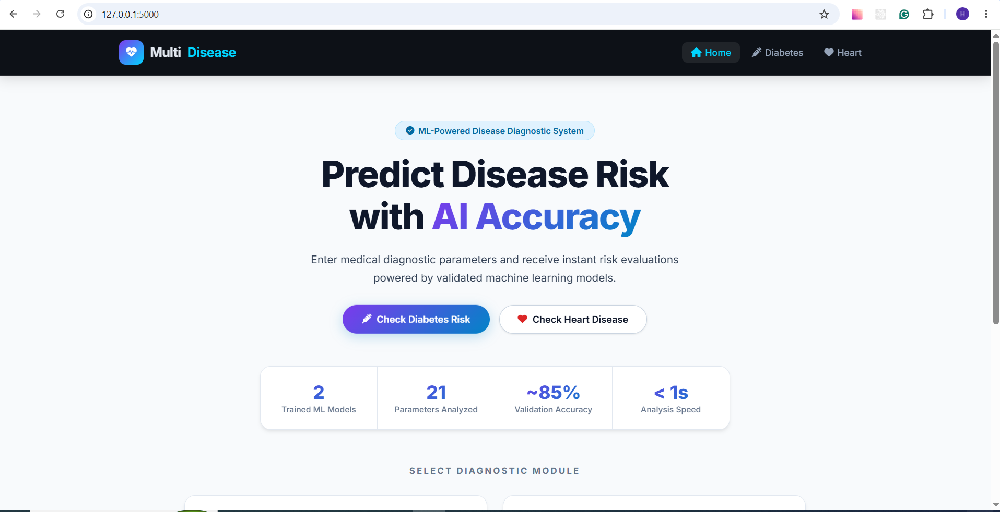
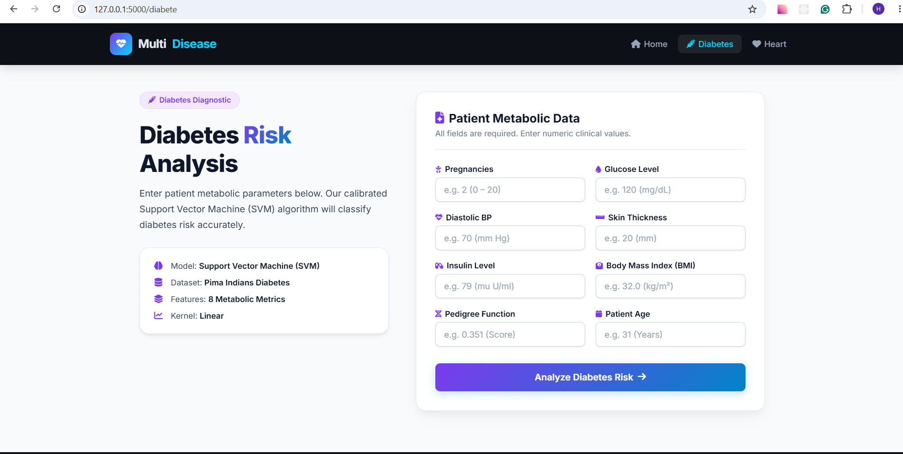
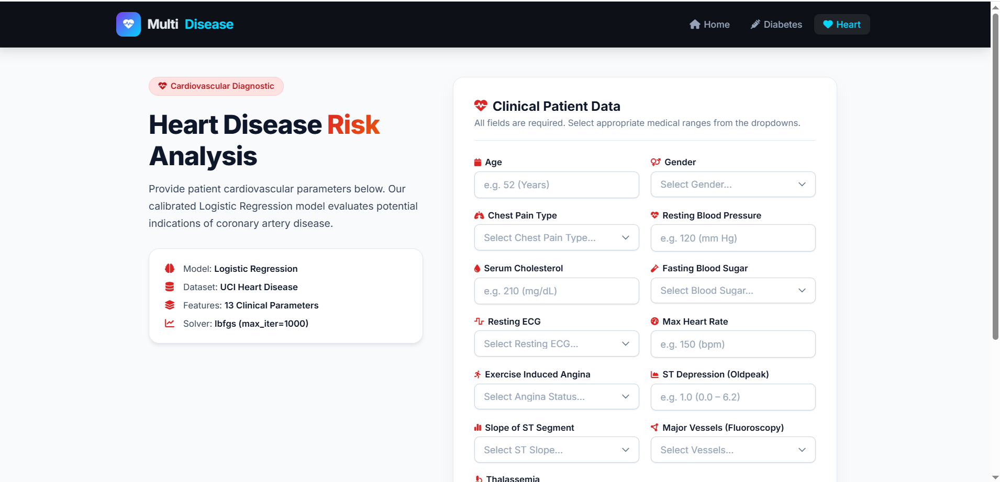
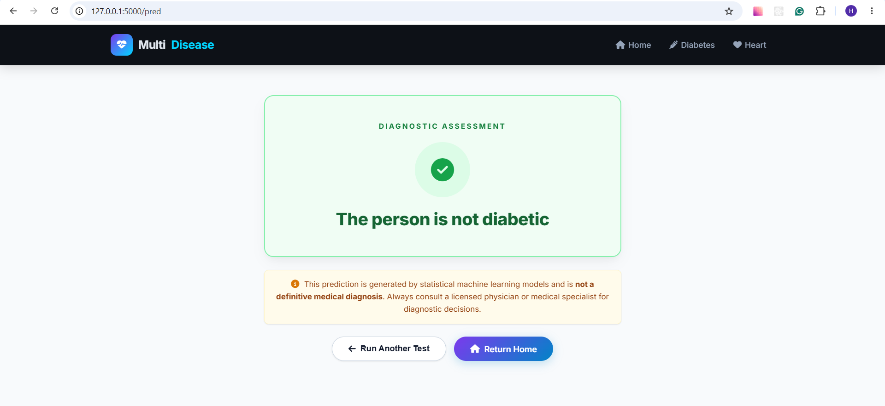

# 🏥 Multi-Disease Prediction System

[](https://www.python.org/)
[](https://flask.palletsprojects.com/)
[](https://scikit-learn.org/)
[]()

An AI-powered diagnostic web application designed to predict the likelihood of multiple chronic diseases—specifically **Diabetes** and **Heart Disease**—using trained machine learning models. Built with a modular **Flask application factory** pattern and a modern, responsive user interface.

---

### 1. Home Dashboard

<!-- Place your Home Page screenshot here -->



---

### 2. Diabetes Risk Prediction

<!-- Place your Diabetes Prediction Page screenshot here -->



---

### 3. Heart Disease Risk Prediction

<!-- Place your Heart Disease Prediction Page screenshot here -->



---

### 4. Prediction Assessment Result

<!-- Place your Prediction Result Page screenshot here -->



---

## ✨ Key Features

- **Multi-Disease Analysis**: Fast, simultaneous risk detection for both Diabetes and Heart Disease in one integrated portal.
- **Accurate Machine Learning Algorithms**:
  - **Support Vector Machine (SVM)** for high-precision diabetes risk classification.
  - **Logistic Regression** for cardiovascular pattern detection.
- **User-Friendly Medical Forms**:
  - Categorical medical fields powered by intuitive dropdown menus (`Male/Female`, `Chest Pain Type`, `Resting ECG`, `ST Slope`, etc.).
  - Strict client-side and server-side `required` field validation to prevent missing or invalid data.

---

## 🧠 Machine Learning Models & Datasets

| Disease Module    | Algorithm                           | Dataset                       | Input Parameters                                                                                                                                          |
| ----------------- | ----------------------------------- | ----------------------------- | --------------------------------------------------------------------------------------------------------------------------------------------------------- |
| **Diabetes**      | Support Vector Machine (Linear SVM) | Pima Indians Diabetes Dataset | 8 Features: Pregnancies, Glucose, Blood Pressure, Skin Thickness, Insulin, BMI, Diabetes Pedigree, Age                                                    |
| **Heart Disease** | Logistic Regression (`lbfgs`)       | UCI Heart Disease Dataset     | 13 Features: Age, Gender, Chest Pain, Resting BP, Cholesterol, Fasting Blood Sugar, ECG, Max HR, Angina, ST Depression, Slope, Major Vessels, Thalassemia |

---

## 📁 Project Directory Structure

```text
Multi_Disease/
├── app/
│   ├── __init__.py            # Application factory (create_app), model loading & logging
│   ├── models/                # Trained machine learning pickle models
│   │   ├── diabetes_model.pkl
│   │   └── heart_disease_model.pkl
│   ├── routes/                # Blueprint route controllers
│   │   ├── __init__.py
│   │   ├── main.py            # Home route (/)
│   │   ├── diabetes.py        # Diabetes routes (/diabete, /pred)
│   │   └── heart.py           # Heart routes (/heart, /heartpred)
│   ├── static/
│   │   └── images/            # Static assets and banners
│   └── templates/             # Jinja2 HTML templates
│       ├── base.html          # Global layout (dark header/footer, light body)
│       ├── home.html          # Main landing dashboard
│       ├── diabetes.html      # Diabetes input form & clinical metadata
│       ├── heart.html         # Heart disease input form with dropdowns
│       ├── prediction.html    # Diagnostic result assessment page
│       └── errors/            # Custom 404 and 500 error pages
│           ├── 404.html
│           └── 500.html
├── training/                  # Offline model training scripts & datasets
│   ├── data/
│   │   ├── diabetes.csv
│   │   └── heart.csv
│   ├── train_diabetes.py
│   └── train_heart.py
├── .gitignore                 # Git ignore rules for venv, pycache, etc.
├── config.py                  # Environment configurations (Dev / Prod)
├── requirements.txt           # Project dependencies
├── run.py                     # Application entry point
└── README.md                  # Project documentation
```

---

## 🚀 Quick Start Guide

### 1. Prerequisites

Ensure you have **Python 3.10+** installed on your system.

### 2. Clone the Repository

```bash
git clone https://github.com/your-username/Multi_Disease.git
cd Multi_Disease
```

### 3. Create and Activate a Virtual Environment

```bash
# Windows (PowerShell)
python -m venv venv
.\venv\Scripts\Activate.ps1

# Windows (Command Prompt)
.\venv\Scripts\activate.bat

# Linux / macOS
python3 -m venv venv
source venv/bin/activate
```

### 4. Install Dependencies

```bash
pip install -r requirements.txt
```

### 5. Run the Application

```bash
python run.py
```

Open your browser and navigate to:

```
http://127.0.0.1:5000
```

---

## 🛠️ Retraining Models (Optional)

If you modify or update the dataset files inside `training/data/`:

```bash
# Train Diabetes model (outputs to app/models/diabetes_model.pkl)
python training/train_diabetes.py

# Train Heart Disease model (outputs to app/models/heart_disease_model.pkl)
python training/train_heart.py
```

---

## 🌐 Routes & Endpoints

| Endpoint     | Method | Description                                      |
| ------------ | ------ | ------------------------------------------------ |
| `/`          | `GET`  | Home dashboard & module selector                 |
| `/diabete`   | `GET`  | Diabetes diagnostic input form                   |
| `/pred`      | `POST` | Processes diabetes form & returns diagnosis      |
| `/heart`     | `GET`  | Heart disease diagnostic form with dropdowns     |
| `/heartpred` | `POST` | Processes heart disease form & returns diagnosis |

---

## ⚠️ Medical Disclaimer

> **Important**: This software is designed solely for academic and demonstrative purposes. The diagnostic predictions are statistical inferences generated by machine learning models and must **not** replace professional clinical consultation, diagnosis, or medical treatment by a licensed physician.

---

## 👨‍💻 Authors

- **Haseeb**
- Built with Python, Flask, Scikit-Learn & HTML/CSS.
